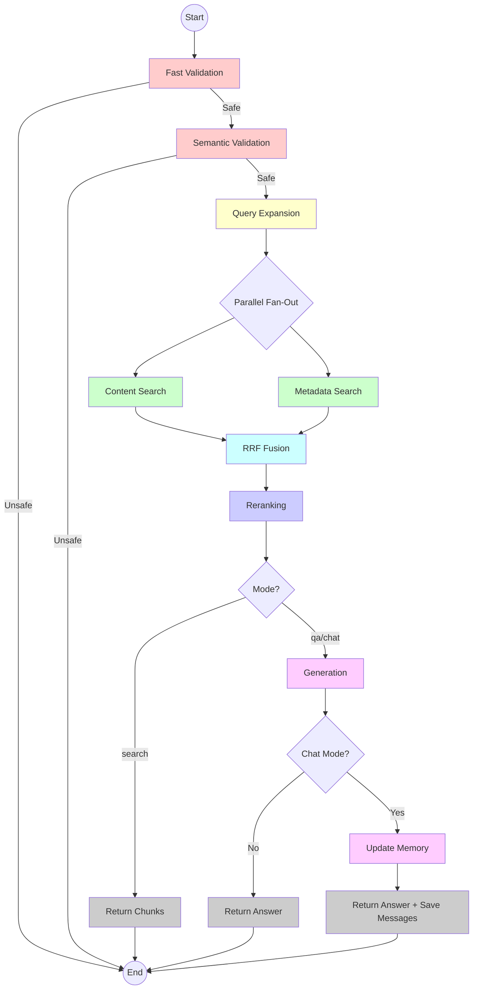

# LangChain RAG Lab

This project serves as a **conversational AI lab**, providing a flexible framework for **Retrieval Augmented Generation (RAG) pipelines**. It focuses on intelligently chunking text documents using various strategies, built with a hexagonal architecture to ensure maintainability, scalability, and modularity.

> **📖 Looking to run the system?** See [USAGE.md](USAGE.md) for installation, CLI reference, and practical examples.

## Features

### Core Features
*   **Multiple Chunking Strategies**: Supports Length-Based, Structure-Based, Semantic, and Full Document Chunking.
*   **Hexagonal Architecture**: Clean separation of concerns for robust and testable code.
*   **Pluggable Storage Backends**:
    *   **LanceDB** (Default): High-performance hybrid search with vector + BM25
    *   **ChromaDB**: Alternative vector store with dual collection support
    *   **FileSystem**: Local JSON storage for development/testing
    *   **All stores support**: `collection_name` and `persist_directory` for flexible configuration
*   **Modern CLI**: Easy-to-use subcommand-based interface (`save`, `talk`, `search`, `chat`, `clean`, `info`).
*   **LangGraph Orchestration**: State-machine based workflow for granular control and flexible execution paths.
*   **Three-Tier Use Case Strategy**: SearchUseCase (chunks only), TalkUseCase (Q&A), ChatUseCase (conversational).
*   **Session Management**: Multi-session support with in-memory conversation history.
*   **Google Gemini Integration**: Uses Google's embedding and language models.
*   **RAG Evaluation**: Built-in evaluation suite using the Ragas library to measure performance.

### 🚀 Enhanced RAG Architecture
*   **Query Expansion Strategies**: Transform queries for better retrieval using HyDE, Step-Back, Subqueries, Zero-Shot, or Few-Shot prompting.
*   **Metadata-Aware Search**: Dual collection support for content and metadata with separate embeddings.
*   **Ensemble Retrieval**: Combines multiple search strategies using **Reciprocal Rank Fusion (RRF)**.
*   **Dual Reranking Strategies**:
    *   **Encoder-Based** (Default): Local reranking using `cross-encoder/ms-marco-MiniLM-L-6-v2`.
    *   **LLM-Based** (Optional): Intelligent reordering using Google Gemini (`--llm-rerank`).
*   **Security Guardrails**: Multi-layer protection using Regex Fast Rules and Semantic Guardrails (LlamaGuard).
*   **Strict Grounding**: System instructions enforced via prompt templates to prevent hallucinations and jailbreaks.
*   **Rich Metadata Extraction**: Automatically extracts headers, filenames, and section titles.

### 💬 Conversational Features
*   **LangGraph-Based Memory**: State machine approach to conversation management with in-memory history.
*   **Sliding Window Memory**: Configurable conversation window (default: 5 exchanges) to maintain context without overwhelming the LLM.
*   **Session Persistence**: Conversations cached by `(user_id, session_id)` for seamless multi-session support.
*   **Interactive Commands**: Built-in `/history`, `/stats`, `/sessions`, `/help`, `/clear` commands for session management.
*   **Auto-Session IDs**: Automatic generation of session identifiers for quick testing.
*   **Memory Introspection**: Real-time statistics about conversation state (message count, exchanges, window size).

## Technologies Used

*   **Python 3.11+**: The primary programming language.
*   **Poetry**: For dependency management and project packaging.
*   **LangChain**: Framework for LLM orchestration.
*   **LangGraph**: State machine framework for workflow orchestration.
*   **LanceDB**: Default vector database with hybrid search (vector + BM25).
*   **ChromaDB**: Alternative vector database for document chunks.
*   **Google Gemini**: Used for Embeddings and Language Modeling.
*   **LlamaGuard**: AI-powered semantic guardrail for input validation.
*   **Sentence Transformers**: Local Cross-Encoders for fast reranking.
*   **Ragas**: Framework for evaluating RAG pipelines.

## Table of Contents

- [Core Concepts](#core-concepts)
  - [Chunking Strategies](#chunking-strategies)
- [Architecture](#architecture)
  - [Three-Layer Architecture](#three-layer-architecture)
  - [Layers](#layers)
  - [Storage Backend Architecture](#storage-backend-architecture)
  - [Data Flow Overview](#data-flow-overview)
- [Enhanced RAG Architecture Deep Dive](#enhanced-rag-architecture-deep-dive)
  - [Storage Backend Strategy](#storage-backend-strategy)
  - [Ensemble Retrieval with RRF](#ensemble-retrieval-with-rrf)
  - [Retriever Selection](#retriever-selection)
  - [Reranking System](#reranking-system)
  - [Metadata Extraction](#metadata-extraction)
- [Query Expansion Strategies](#query-expansion-strategies)
  - [Available Strategies](#available-strategies)
  - [Query Expansion Architecture](#query-expansion-architecture)
  - [Performance Considerations](#performance-considerations)
- [LangGraph Orchestration & Use Case Strategy](#langgraph-orchestration--use-case-strategy)
  - [Three-Tier Use Case Architecture](#three-tier-use-case-architecture)
  - [Unified Pipeline with Flexible Endpoints](#unified-pipeline-with-flexible-endpoints)
  - [Comparison of Use Cases](#comparison-of-use-cases)
  - [Workflow Logic](#workflow-logic)
  - [Benefits of Graph Architecture](#benefits-of-graph-architecture)
- [Conversation Memory System](#conversation-memory-system)
  - [Memory Architecture](#memory-architecture)
  - [Session Management](#session-management)
  - [Memory Window Strategy](#memory-window-strategy)
- [Security & Grounding](#security--grounding)
  - [Multi-Layer Security Workflow](#multi-layer-security-workflow)
  - [Prompt Grounding Strategy](#prompt-grounding-strategy)
- [Contributing](#contributing)
- [License](#license)
- [Acknowledgments](#acknowledgments)

---

## Core Concepts

This project is designed around three core chunking strategies, each suited for different types of documents and use cases. Understanding these strategies will help you choose the best approach for your needs.

### Chunking Strategies

1.  **Length-Based Chunking**:
    This is the most straightforward method. It splits the text into chunks of a specified size, with an optional overlap between them. It's fast and simple but doesn't consider the content's structure or meaning.
    *   **Mode Options**:
        *   `character`: Splits by character count (faster, simpler)
        *   `token`: Splits by token count (more accurate for LLM context windows)

2.  **Structure-Based Chunking**:
    This method leverages the document's structure, such as Markdown headers, to create more meaningful chunks. It's ideal for well-structured documents like technical manuals or articles, as it keeps related content together.

3.  **Semantic Chunking**:
    This advanced technique uses NLP models to split the text based on semantic similarity. It identifies topic shifts and creates chunks that are contextually coherent. It's best for unstructured or semi-structured documents where preserving meaning is crucial.

4.  **Full Document Chunking**:
    This strategy treats the entire document as a single chunk. It is useful for smaller documents or when using LLMs with very large context windows where splitting is unnecessary.

---

## Architecture

This project is built using a **Hexagonal Architecture** (also known as Ports and Adapters) with a **three-layer design** for clean separation of concerns.

### Three-Layer Architecture

```
┌─────────────────────────────────────────┐
│  Entry Points (CLI, API, etc)           │
│  - Parse arguments/requests             │
│  - Call use cases                       │
└──────────────┬──────────────────────────┘
               │
┌──────────────▼──────────────────────────┐
│  Use Cases (Application Layer)          │
│  - Create dependencies                  │
│  - Inject into services                 │
│  - Coordinate service calls             │
│  - Manage conversation sessions         │
│  - Orchestrate LangGraph workflows      │
└──────────────┬──────────────────────────┘
               │
┌──────────────▼──────────────────────────┐
│  Services (Domain Layer)                │
│  - Business logic                       │
│  - Reusable components                  │
└─────────────────────────────────────────┘
```

**Benefits:**
- **Entry Points** are thin adapters that only parse input and call use cases
- **Use Cases** orchestrate dependencies and coordinate LangGraph workflows
- **Services** contain reusable business logic shared across graph nodes
- **Session Management** lives at the container level for proper lifecycle control

### Layers

*   **Domain Layer** (`src/domain`): Contains the business logic, core entities, and service implementations.
    *   **Guardrails**: `InputGuard` (Multi-layer security gateway using Regex and LlamaGuard).
    *   **Models**: `Document`, `Chunk`, `SearchResult` (Core entities with relevance scoring).
    *   **Services**:
        *   `MetadataManager`: Centralized metadata normalization and keyword extraction (YAKE).
    *   **Enums**: `StorageType`, `LengthBasedChunkingMode`, `SemanticChunkingThresholdType`, `QueryExpansionStrategy`.

*   **Application Layer** (`src/application`): Orchestrates business logic via Use Cases and defines Port interfaces.
    *   **LangGraph Components**:
        *   `RAGState`: Shared state schema for all graph nodes
        *   `RAGNodes`: Implementation of all pipeline nodes (validation, expansion, retrieval, fusion, reranking, generation)
        *   `create_rag_graph()`: Factory for creating graphs with different execution modes
    *   **Use Cases**:
        *   `SearchUseCase`: Orchestrates retrieval pipeline (validation → expansion → retrieval → fusion → reranking)
        *   `TalkUseCase`: Adds generation layer for one-shot Q&A (extends SearchUseCase with answer generation)
        *   `ChatUseCase`: Adds conversation memory for multi-turn conversations (extends TalkUseCase with session state)
        *   `ChunkingUseCase`: Manages document decomposition strategies
        *   `StorageUseCase`: Coordinates persistence and retrieval operations
    *   **Ports (Interfaces)**: `ChunkStore`, `GuardrailModel`, `LanguageModel`, `EmbeddingModel`, `Reranker`, `Retriever`, `QueryExpander`, `DocumentLoader`, `ChunkingStrategy`.

*   **Infrastructure Layer** (`src/infrastructure`): Concrete adapters for external services and technologies.
    *   **Retrieval Services**:
        *   `SimpleRetriever`: Basic vector search with optional query expansion
        *   `EnsembleRetriever`: Advanced RRF-based retrieval combining content + metadata search
    *   **Storage Backends**:
        *   `LanceChunkStore` (Default): High-performance hybrid search (vector + BM25)
        *   `ChromaChunkStore`: Dual collection vector store
        *   `FileSystemChunkStore`: Local JSON storage
        *   **All stores support**: `collection_name` and `persist_directory` parameters
    *   **AI Models**:
        *   `GoogleGenAILanguageModel` (Gemini)
        *   `GoogleGenAIEmbeddingModel`
        *   `LlamaGuard` (Safety Adapter)
    *   **Query Expansion**:
        *   `HyDEGenerator`: Hypothetical document generation
        *   `StepBackGenerator`: Broader question generation
    *   **Rerankers**:
        *   `EncoderReranker` (Local MS-Marco, Default)
        *   `LLMReranker` (Gemini-based, Optional)
    *   **Data Ingestion**:
        *   `MarkdownDocumentLoader`: Markdown reader and parser
    *   **CLI**:
        *   `main.py`: Command-line interface with session-aware chat mode
    *   **Dependency Management**:
        *   `DependencyContainer`: Session-aware dependency injection with conversation caching

### Storage Backend Architecture

The system resolves storage backends based on a strict priority system defined in the CLI arguments:

```
┌──────────────────────────────────────────────┐
│            Storage Backend Priority          │
├──────────────────────────────────────────────┤
│  1. --filesystem       → FileSystem          │
│  2. --chroma           → ChromaDB            │
│  3. --lance            → LanceDB ⭐          │
│  4. Default (No flags) → LanceDB ⭐          │
└──────────────────────────────────────────────┘
```

**All storage backends support**:
- `--collection <name>`: Collection/table name for organizing data
- `--storage-path <path>`: Custom storage directory (None = use store's default)

**Default Locations** (when `--storage-path` is not specified):
- **LanceDB**: `./lancedb`
- **ChromaDB**: `./chroma_db`
- **FileSystem**: `./filesystem_db`

**LanceDB Advantages** (Default):
- Native hybrid search (vector + BM25)
- 10-100x faster than ChromaDB for large datasets
- Built-in full-text search without dual collections

**When to use ChromaDB**:
- Explicit compatibility requirements
- Existing ChromaDB infrastructure
- Dual collection strategy preference

**When to use FileSystem**:
- Development/testing
- Small datasets (<1000 chunks)
- No database dependencies needed

### Data Flow Overview

#### Save Command Data Flow
```
┌─────────────────┐
│  Raw Documents  │
│  (data/*.md)    │
└────────┬────────┘
         │
         ▼
┌─────────────────┐
│ Document Loader │ (MarkdownDocumentLoader)
└────────┬────────┘
         │
         ▼
┌─────────────────┐
│    Document     │ (Domain Model)
│    Objects      │
└────────┬────────┘
         │
         ▼
┌─────────────────┐
│ Chunking Use    │
│     Case        │
└────────┬────────┘
         │
         ▼
┌─────────────────┐
│                 │ (Strategy Pattern)
│    Chunking     │ - Length-Based
│    Strategy     │ - Structure-Based
│                 │ - Semantic
│                 │ - Full Document
└────────┬────────┘
         │
         ▼
┌─────────────────┐
│     Chunk       │ (Domain Model)
│    Objects      │
└────────┬────────┘
         │
         ▼
┌────────────────────────────────────────────────────┐
│         Storage Backend (Adapter)                  │
│  - LanceDB (Default, --lance flag, Hybrid Search)  │
│  - ChromaDB (--chroma flag)                        │
│  - FileSystem (--filesystem flag)                  │
│                                                    │
│  All support:                                      │
│  • collection_name (data organization)             │
│  • persist_directory (custom location)             │
└────────────────────────────────────────────────────┘
```

---

## Enhanced RAG Architecture Deep Dive

The enhanced RAG system introduces several advanced components to improve retrieval accuracy and relevance.

### Storage Backend Strategy

The system supports three storage backends with automatic selection:

**1. LanceDB (Default)** ⭐
- **Native hybrid search**: Vector + BM25 in single collection
- **Performance**: 10-100x faster for large datasets
- **Zero-config**: No dual collection management needed
- **Customizable**: Supports both `collection_name` and `persist_directory`

**2. ChromaDB (--chroma flag)**
- **Dual collection strategy**: Separate content + metadata collections
- **Explicit opt-in**: Use when ChromaDB compatibility required
- **Customizable**: Supports both `collection_name` and `persist_directory`

**3. FileSystem (--filesystem flag)**
- **Local JSON storage**: Simple file-based persistence
- **No database**: Zero external dependencies
- **Use case**: Development, testing, small datasets
- **Customizable**: Supports both `collection_name` and `persist_directory`

### Ensemble Retrieval with RRF

The `EnsembleRetriever` combines multiple search strategies using **Reciprocal Rank Fusion (RRF)**:

**Algorithm**:
```
for each chunk_id in results:
    rrf_score = 0
    for each retriever:
        if chunk found by retriever:
            rrf_score += weight / (k + rank)
    final_scores[chunk_id] = rrf_score
```

Where:
- `k = 60` (RRF constant, balances score distribution)
- `weight` = configurable weight for each retriever (default: 1.0)
- `rank` = position in that retriever's results (1-indexed)

**Benefits**:
- Combines evidence from multiple sources
- Reduces impact of outliers from any single retrieval method
- No need to normalize scores across different retrieval methods

### Retriever Selection

The system automatically selects the appropriate retriever based on configuration:

| Configuration | Retriever | Behavior |
|--------------|-----------|----------|
| Default | `EnsembleRetriever` | Dual collection search (content + metadata) with RRF fusion |
| `--single-collection` | `SimpleRetriever` | Single vector search (content only) |
| Query Expansion | Either retriever | Expands query → retrieves for each → deduplicates results |

### Reranking System

The system supports a multi-stage reranking process to maximize relevance:

1.  **Encoder-Based Reranking (DEFAULT)**:
    *   Uses a local Cross-Encoder model (`ms-marco-MiniLM-L-6-v2`).
    *   **Pros**: Ultra-fast (milliseconds), runs locally on CPU/MPS, zero cost.
    *   **Behavior**: Pairs the query with each candidate and predicts a relevance score.
2.  **LLM-Based Reranking (OPTIONAL)**:
    *   Uses Google Gemini to analytically re-order results.
    *   **Pros**: Higher semantic understanding for complex queries.
    *   **Enable via**: `--llm-rerank` CLI flag.

### Metadata Extraction

Chunking strategies automatically extract rich metadata:

| Strategy | Extracted Metadata |
|----------|-------------------|
| **Semantic** | filename, headers (from content), section_title, doc_type |
| **Structure-Based** | filename, headers (from hierarchy), section_title, doc_type |
| **Length-Based** | filename, doc_type |

**Metadata Filtering**: Lists are converted to comma-separated strings for database compatibility.

---

## Query Expansion Strategies

Query expansion transforms the original user query to improve retrieval quality by generating alternative formulations that may match relevant documents more effectively.

### Available Strategies

#### 1. **HyDE (Hypothetical Document Embeddings)**

**How it works**:
- Generates a hypothetical answer to the user's question
- Searches using both the original query and the hypothetical answer
- The hypothesis often contains vocabulary and concepts similar to actual relevant documents

**When to use**:
- Complex questions requiring detailed answers
- Technical queries where you want to match against document-style content
- When documents contain answers rather than questions

**Example**:
```
Original: "What is RAG?"
HyDE Generated: "Retrieval Augmented Generation (RAG) is a technique that combines
information retrieval with language model generation. It works by first retrieving
relevant documents from a knowledge base, then using those documents as context..."
```

#### 2. **Step-Back Prompting**

**How it works**:
- Transforms specific questions into broader, more general questions
- Retrieves high-level concepts first, then uses them to answer the specific query
- Helps when the specific question is too narrow to match relevant documents

**When to use**:
- Very specific questions that might miss broader relevant content
- Multi-hop reasoning scenarios
- When you need conceptual understanding before specific details

**Example**:
```
Original: "What happens to the pressure of an ideal gas if temperature doubles
and volume increases by a factor of 8?"
Step-Back: "What are the physics principles behind the ideal gas law?"
```

#### 3. **Subqueries Decomposition**

**How it works**:
- Breaks complex multi-part questions into focused sub-questions
- Retrieves documents for each sub-question independently
- Combines results for comprehensive answer coverage

**When to use**:
- Complex questions with multiple aspects
- Multi-hop reasoning requirements
- When comprehensive coverage is more important than speed

#### 4. **Zero-Shot Expansion**

**How it works**:
- Uses prompt engineering to reformulate queries without examples
- Quick query understanding and expansion
- Minimal latency overhead

**When to use**:
- Need fast query reformulation
- Simple to moderate complexity queries
- When example-based learning isn't necessary

#### 5. **Few-Shot Expansion**

**How it works**:
- Leverages example-based learning for query understanding
- Provides context through examples
- Improves domain-specific query handling

**When to use**:
- Domain-specific technical queries
- When you have example query patterns
- Need guided query understanding

### Query Expansion Architecture

```
┌─────────────────┐
│  Original Query │
└────────┬────────┘
         │
         ▼
┌────────────────────────────┐
│  QueryExpander (Optional)  │
│  - HyDEGenerator           │
│  - StepBackGenerator       │
│  - SubqueriesGenerator     │
│  - ZeroShotExpander        │
│  - FewShotExpander         │
└────────┬───────────────────┘
         │
         ▼
┌─────────────────────────┐
│  Expanded Queries       │
│  [Original, Expanded]   │
└────────┬────────────────┘
         │
         ▼
┌─────────────────────────┐
│  Retrieval for Each     │
│  Query Variation        │
└────────┬────────────────┘
         │
         ▼
┌─────────────────────────┐
│  Aggregate & Deduplicate│
│  Results by chunk_id    │
└─────────────────────────┘
```

### Performance Considerations

| Strategy | Latency Impact | Cost | Best For |
|----------|---------------|------|----------|
| **No Expansion** | None | Free | Simple queries, well-matched vocabulary |
| **HyDE** | +1 LLM call | Low | Complex questions, technical content |
| **Step-Back** | +1 LLM call | Low | Specific questions, multi-hop reasoning |
| **Subqueries** | +1 LLM call | Low | Multi-part complex questions |
| **Zero-Shot** | +1 LLM call | Low | Fast reformulation needs |
| **Few-Shot** | +1 LLM call | Low | Domain-specific queries |

**Key Design Principles**:
- **Single Parameter**: Retrievers accept one `query_expander` object (not multiple strategy flags)
- **Automatic Activation**: If a query expander is injected, it's used automatically
- **Type-Safe**: Uses `QueryExpansionStrategy` enum for validation
- **Cached**: Query expanders are singleton instances per strategy type

---

## LangGraph Orchestration & Use Case Strategy

The project uses **LangGraph** to orchestrate the RAG pipeline as a state machine, providing a unified architecture that supports three different use cases with varying execution depths.

### Three-Tier Use Case Architecture

The system implements a **layered use case strategy** where all three use cases share the same underlying pipeline but terminate at different stages:

```
┌──────────────────────────────────────────────────────────┐
│                   Shared Pipeline Layers                 │
├──────────────────────────────────────────────────────────┤
│                                                          │
│  Layer 1: Security Validation                            │
│  ├─ Fast Validation (Regex)                              │
│  └─ Semantic Validation (LlamaGuard)                     │
│                                                          │
│  Layer 2: Query Understanding                            │
│  └─ Query Expansion (HyDE/StepBack/etc, Optional)        │
│                                                          │
│  Layer 3: Retrieval                                      │
│  ├─ Content Search (Parallel)                            │
│  ├─ Metadata Search (Parallel)                           │
│  └─ RRF Fusion                                           │
│                                                          │
│  Layer 4: Reranking                                      │
│  └─ Cross-Encoder or LLM Reranking                       │
│                                                          │
│  ┌────────────────────────────────────────────┐          │
│  │ SearchUseCase ENDS HERE → Returns Chunks   │          │
│  └────────────────────────────────────────────┘          │
│                                                          │
│  Layer 5: Answer Generation                              │
│  └─ Language Model (Grounded Prompt)                     │
│                                                          │
│  ┌────────────────────────────────────────────┐          │
│  │ TalkUseCase ENDS HERE → Returns Answer     │          │
│  └────────────────────────────────────────────┘          │
│                                                          │
│  Layer 6: Conversation Memory                            │
│  └─ Message History Management (Sliding Window)          │
│                                                          │
│  ┌────────────────────────────────────────────┐          │
│  │ ChatUseCase ENDS HERE → Returns Answer     │          │
│  │ + Maintains Conversation State             │          │
│  └────────────────────────────────────────────┘          │
│                                                          │
└──────────────────────────────────────────────────────────┘
```

### Unified Pipeline with Flexible Endpoints

**Graph Factory Design**:

The `create_rag_graph()` factory creates different execution paths based on mode:

```
┌─────────────────────────────────────────────────┐
│          Graph Factory (create_rag_graph)       │
├─────────────────────────────────────────────────┤
│  Mode Parameter:                                │
│  ├─ "search"  → Ends at reranking              │
│  ├─ "qa"      → Ends at generation             │
│  └─ "chat"    → Includes memory management     │
└─────────────────────────────────────────────────┘
```

**Execution Paths**:

```
┌─────────────┐
│   START     │
└──────┬──────┘
       │
       ├──────────────────────┬──────────────────────┐
       │                      │                      │
       ▼                      ▼                      ▼
┌─────────────────┐  ┌─────────────────┐  ┌─────────────────┐
│  SearchUseCase  │  │  TalkUseCase    │  │  ChatUseCase    │
│  (Mode: search) │  │  (Mode: qa)     │  │  (Mode: chat)   │
└─────────────────┘  └─────────────────┘  └─────────────────┘
       │                      │                      │
       ▼                      ▼                      ▼
Fast Validation      Fast Validation      Fast Validation
       │                      │                      │
       ▼                      ▼                      ▼
Semantic Validation  Semantic Validation  Semantic Validation
       │                      │                      │
       ▼                      ▼                      ▼
Query Expansion      Query Expansion      Query Expansion
       │                      │                      │
       ▼                      ▼                      ▼
Content + Metadata   Content + Metadata   Content + Metadata
   (Parallel)           (Parallel)           (Parallel)
       │                      │                      │
       ▼                      ▼                      ▼
   RRF Fusion           RRF Fusion           RRF Fusion
       │                      │                      │
       ▼                      ▼                      ▼
   Reranking            Reranking            Reranking
       │                      │                      │
       ▼                      ▼                      ▼
┌─────────────────┐           │                      │
│  RETURN CHUNKS  │           ▼                      ▼
└─────────────────┘      Generation            Generation
                              │                      │
                              ▼                      ▼
                     ┌─────────────────┐            │
                     │ RETURN ANSWER   │            ▼
                     └─────────────────┘    Update Conversation
                                                   Memory
                                                      │
                                                      ▼
                                            ┌─────────────────┐
                                            │ RETURN ANSWER   │
                                            │ + Save Messages │
                                            └─────────────────┘
```

### Comparison of Use Cases

| Feature | SearchUseCase | TalkUseCase | ChatUseCase |
|---------|---------------|-------------|-------------|
| **Graph Mode** | `search` | `qa` | `chat` |
| **Fast Validation** | ✅ Regex patterns | ✅ Regex patterns | ✅ Regex patterns |
| **Semantic Validation** | ✅ LlamaGuard | ✅ LlamaGuard | ✅ LlamaGuard |
| **Query Expansion** | ✅ Optional (HyDE/StepBack/etc) | ✅ Optional (HyDE/StepBack/etc) | ✅ Optional (HyDE/StepBack/etc) |
| **Content Retrieval** | ✅ Vector + BM25 | ✅ Vector + BM25 | ✅ Vector + BM25 |
| **Metadata Retrieval** | ✅ Optional (dual collection) | ✅ Optional (dual collection) | ✅ Optional (dual collection) |
| **RRF Fusion** | ✅ Ensemble results | ✅ Ensemble results | ✅ Ensemble results |
| **Reranking** | ✅ Encoder or LLM | ✅ Encoder or LLM | ✅ Encoder or LLM |
| **Answer Generation** | ❌ No generation | ✅ Grounded prompts | ✅ Grounded prompts + history |
| **Conversation Memory** | ❌ No memory | ❌ Stateless | ✅ Sliding window (k exchanges) |
| **Session Management** | ❌ No sessions | ❌ No sessions | ✅ Cached by (user_id, session_id) |
| **Returns** | `List[Chunk]` | `str` (answer) | `str` (answer) |
| **State Persistence** | Stateless | Stateless | Stateful (in-memory) |
| **Checkpointer** | ❌ Not applicable | ❌ Not applicable | ❌ Not used (in-memory only) |
| **Use Case** | Search & retrieval | One-shot Q&A | Multi-turn conversations |
| **CLI Command** | `cli search` | `cli talk` | `cli chat` |

**Key Design Benefits**:
1. **Code Reuse**: All three use cases share the same validation, retrieval, and reranking nodes
2. **Consistency**: Same security guardrails and quality controls across all modes
3. **Flexibility**: Easy to add new use cases by changing the graph endpoint
4. **Maintainability**: Single source of truth for RAG pipeline logic
5. **Testing**: Can test retrieval independently from generation

### Workflow Logic

The following diagram illustrates the detailed node-level flow of the RAG graph:



**Node Responsibilities**:

| Node | Purpose | State Updates |
|------|---------|---------------|
| **Fast Validation** | Regex-based pattern matching for common jailbreaks | `is_safe_fast`, `error` |
| **Semantic Validation** | AI-powered intent detection using LlamaGuard | `is_safe_semantic`, `error` |
| **Query Expansion** | Transform query using selected strategy (optional) | `expanded_queries` |
| **Content Search** | Vector + BM25 search on content collection | `content_results` |
| **Metadata Search** | Vector search on metadata collection (optional) | `metadata_results` |
| **RRF Fusion** | Merge and rank results using Reciprocal Rank Fusion | `candidates` |
| **Reranking** | Cross-encoder or LLM-based result refinement | `chunks` |
| **Generation** | LLM answer generation with grounding | `answer`, `messages` (chat mode) |

### Benefits of Graph Architecture

1.  **Granular Control**: Each step (validation, expansion, search, fusion, reranking, generation) is a discrete node that can be independently updated, monitored, or replaced.

2.  **Parallel Execution**: Content and metadata searches run concurrently in the graph, reducing overall latency without complex async coordination.

3.  **Conditional Routing**: Graph edges allow the system to:
    - Terminate early on security violations
    - Skip metadata search for single-collection mode
    - Route to different endpoints (chunks vs. answers vs. conversational answers)
    - Apply different memory strategies based on use case

4.  **Resilient Execution**: Node-level error handling allows graceful degradation (e.g., if semantic validation fails, fall back to fast validation).

5.  **Observable Workflow**: State updates at each node provide visibility into the pipeline execution for debugging and monitoring.

6.  **Flexible Composition**: New use cases can be created by composing existing nodes with different routing logic.

7.  **Testability**: Individual nodes can be tested in isolation, and entire sub-graphs can be tested independently.

**State Machine Advantages**:

- **Explicit Flow**: The graph structure makes the execution path visible and auditable
- **Reusable Nodes**: Same validation and retrieval logic across all use cases
- **Easy Extensions**: Adding new capabilities (e.g., caching layer) means adding a new node
- **Type Safety**: `RAGState` TypedDict ensures all nodes receive and return expected data structures

---

## Conversation Memory System

The chat system implements a LangGraph-based approach to conversation management with in-memory state persistence.

### Memory Architecture

**Component Structure**:

```
DependencyContainer
  └─ Chat Session Cache
      └─ Key: (user_id, session_id, config, reranking, expansion)
          └─ ChatUseCase Instance
              ├─ RAGNodes (shared pipeline)
              ├─ LangGraph (compiled graph)
              ├─ In-Memory Message List
              │   ├─ HumanMessage(content="...")
              │   ├─ AIMessage(content="...")
              │   └─ (managed by execute() method)
              └─ Memory Window (k exchanges)
```

**Key Features**:

1. **In-Memory History**: Python list maintains conversation messages
   - Lightweight and fast
   - No external dependencies
   - Suitable for single-process applications

2. **Sliding Window**: Automatic context management
   - Keeps last `k` exchanges (default: 5)
   - Prevents context overflow
   - Maintains recent relevant history

3. **State Management**: Graph invocation pattern
   - Previous messages passed in `initial_state["messages"]`
   - New messages extracted from graph result
   - History updated after each query

4. **Session Isolation**: Container-level caching
   - Each session has independent state
   - Sessions identified by composite key
   - Multiple concurrent sessions supported

### Session Management

**Session Lifecycle**:

```
┌─────────────────────────────────────────────┐
│          Session Creation Flow              │
├─────────────────────────────────────────────┤
│                                             │
│  1. User calls get_chat_use_case()          │
│     ├─ Provides: user_id, session_id       │
│     └─ Specifies: config, memory_k          │
│                                             │
│  2. Container checks cache                  │
│     ├─ Key: (user_id, session_id, ...)     │
│     └─ If exists → return cached instance   │
│                                             │
│  3. If not cached → create new              │
│     ├─ Initialize empty message list        │
│     ├─ Build LangGraph with shared nodes    │
│     └─ Cache instance for future calls      │
│                                             │
│  4. Query execution                         │
│     ├─ Load existing messages               │
│     ├─ Pass to graph in initial_state       │
│     ├─ Extract new messages from result     │
│     └─ Update in-memory history             │
│                                             │
│  5. Session termination                     │
│     ├─ /clear → clears history, keeps session │
│     ├─ /exit → ends CLI, session cached    │
│     └─ clear_chat_session() → removes cache │
│                                             │
└─────────────────────────────────────────────┘
```

**Session Identification**:

| Component | Default Value | Purpose |
|-----------|--------------|---------|
| `user_id` | `"default_user"` | User identity for tracking |
| `session_id` | Auto-generated UUID | Conversation grouping |
| `config` | Storage configuration | Retrieval backend settings |
| `use_llm_reranking` | Boolean | Reranking strategy |
| `expansion_strategy` | Optional string | Query expansion mode |

**Cache Key Structure**:
```
session_key = (user_id, session_id, config, use_llm_reranking, expansion_strategy)
```

This composite key allows:
- Multiple sessions per user
- Different configurations per session
- Isolated conversation contexts

### Memory Window Strategy

**Sliding Window Mechanism**:

```
┌─────────────────────────────────────────────────────┐
│        Sliding Window (k=5 exchanges)               │
├─────────────────────────────────────────────────────┤
│                                                     │
│  Exchange 1: [HumanMessage, AIMessage]             │
│  Exchange 2: [HumanMessage, AIMessage]             │
│  Exchange 3: [HumanMessage, AIMessage] ← Window    │
│  Exchange 4: [HumanMessage, AIMessage] ← Window    │
│  Exchange 5: [HumanMessage, AIMessage] ← Window    │
│  Exchange 6: [HumanMessage, AIMessage] ← Window    │
│  Exchange 7: [HumanMessage, AIMessage] ← Window    │
│                                                     │
│  Oldest exchanges (1-2) are not included in        │
│  prompt context but remain in full history         │
│                                                     │
└─────────────────────────────────────────────────────┘
```

**Benefits**:
- **Controlled Context Size**: Prevents overwhelming the LLM with too much history
- **Recency Bias**: Most recent exchanges are more relevant to current query
- **Configurable**: Adjust `memory_k` based on use case (longer for deep discussions)
- **Performance**: Reduces token usage and inference time

**Memory Statistics**:

Available via `get_memory_stats()`:
- `user_id`: Session owner
- `session_id`: Conversation identifier
- `total_messages`: Complete message count (Human + AI)
- `exchanges`: Number of conversation turns (pairs of messages)
- `memory_window_k`: Configured window size

---

## Security & Grounding

This project implements a multi-layer security approach to ensure that the LLM provides safe, grounded, and accurate answers.

### Multi-Layer Security Workflow

```
┌───────────────────┐
│    User Query     │
└─────────┬─────────┘
          │
          ▼
┌───────────────────────────────────┐
│   Layer 1: Fast Rules (Regex)     │  ← Blocks common jailbreaks
│   Check: GuardrailConfig.PATTERNS │     (SQL injection, XSS, etc.)
│   Node: fast_validation           │
└─────────┬─────────────────────────┘
          │ (Pass)
          ▼
┌───────────────────────────────────┐
│   Layer 2: Semantic (LlamaGuard)  │  ← AI-powered intent detection
│   Check: LlamaGuard.validate()    │     (malicious intent, safety)
│   Node: semantic_validation       │
└─────────┬─────────────────────────┘
          │ (Pass)
          ▼
┌───────────────────────────────────┐
│   Layer 3: RAG Pipeline           │  ← Controlled retrieval
│   Nodes: expansion → search →     │     (only documented sources)
│          fusion → reranking       │
└─────────┬─────────────────────────┘
          │ (Retrieved Context)
          ▼
┌───────────────────────────────────┐
│   Layer 4: Strict Grounding       │  ← Prompt instructions
│   Template: query_template.txt    │     (answer only from context)
│   Node: generation                │
└─────────┬─────────────────────────┘
          │ (Grounded Answer)
          ▼
┌───────────────────────────────────┐
│     Safe Response to User         │
└───────────────────────────────────┘
```

**Layer Responsibilities**:

| Layer | Technology | Purpose | Failure Mode |
|-------|-----------|---------|--------------|
| **Fast Validation** | Regex patterns | Block obvious attacks | Terminate with security message |
| **Semantic Validation** | LlamaGuard | Detect malicious intent | Terminate with security message |
| **RAG Pipeline** | Vector search | Limit to documented knowledge | Return only relevant chunks |
| **Strict Grounding** | Prompt template | Prevent hallucinations | Answer only from provided context |

### Prompt Grounding Strategy

The `generation` node uses a strict system prompt (`assets/templates/query_template.txt`) that enforces:

1. **No Hallucinations**: "Do not use outside knowledge or make assumptions"
2. **Evidence-Based**: "Only answer if the information is explicitly in the provided context"
3. **Safety First**: "Refuse to answer harmful, inappropriate, or out-of-scope questions"
4. **Context Awareness**: "Consider the conversation history while staying grounded in documentation"
5. **Honest Limitations**: "If you don't know or can't find it in the context, say so clearly"

**Grounding Template Structure**:
```
System Instructions:
  ├─ Role definition (helpful documentation assistant)
  ├─ Core constraints (no hallucinations, evidence-based)
  ├─ Safety guidelines (refuse harmful requests)
  └─ Response format (clear, concise, sourced)

Conversation History:
  └─ Last k exchanges (sliding window)

Retrieved Context:
  └─ Top chunks from RAG pipeline

Current Query:
  └─ User's latest question

Output:
  └─ Grounded answer or refusal
```

---

**🚀 Ready to start?** Head over to [USAGE.md](USAGE.md) for installation instructions, CLI examples, and technical details!